# LABORATORIO 5 - CVDS
## Integrantes:
* Camilo Nicolás Murcia Espinosa
* David Leonardo Piñeros Cortés

# Parte 1
### Peticion GET
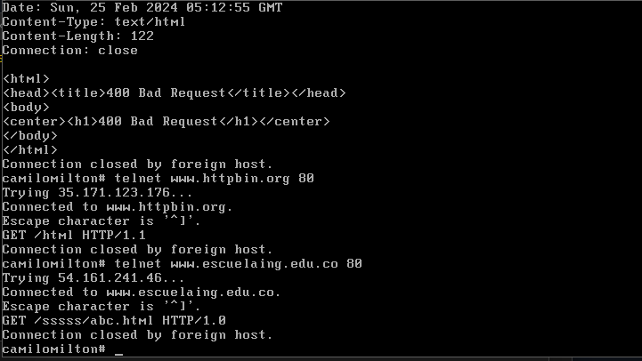


graph TD
App -->|Interacts with| SparkServer
App -->|Interacts with| MedAppointmentService
App -->|Spawns| ClientHandler

subgraph Request Processing
	ClientHandler -->|Handles GET| handleGetRequest
	ClientHandler -->|Processes Service Calls| callService
end

SparkServer -->|POST Routes| AddMedAppointmentService
SparkServer -->|GET Routes| ListAppointmentService
AddMedAppointmentService -->|Relies on| MedAppointmentService
ListAppointmentService -->|Relies on| MedAppointmentService
MedAppointmentService -->|Administers| MedAppointment
```

¿Qué codigo de error sale?, revise el significado del mismo en la lista de códigos de estado HTTP.

Códigos 200 (Éxito):
* 200 OK: Indica que la solicitud se ha completado correctamente, y el servidor está devolviendo los datos solicitados.
  
Códigos 300 (Redirecciones):
* 301 Moved Permanently: El recurso solicitado se ha movido permanentemente a una nueva ubicación. Los navegadores deben actualizar sus marcadores y enlaces.
* 302 Found (o 302 Found Temporary): Indica una redirección temporal. Los navegadores pueden mantener el enlace original en su caché.
* 304 Not Modified: Indica que la página no ha cambiado desde la última vez que se accedió a ella, y se puede usar la versión en caché.

Códigos 400 (Errores del Cliente):
* 400 Bad Request: La solicitud enviada al servidor es incorrecta o no puede ser procesada.
* 401 Unauthorized: Se requiere autenticación para acceder al recurso.
* 403 Forbidden: El servidor comprende la solicitud, pero no permite el acceso al recurso.
* 404 Not Found: El recurso solicitado no se encuentra en el servidor.

Códigos 500 (Errores del Servidor):
* 500 Internal Server Error: Indica un error en el servidor que impide que la solicitud se complete correctamente.
* 502 Bad Gateway: El servidor, mientras actuaba como puerta de enlace o proxy, recibió una respuesta no válida del servidor ascendente.
* 503 Service Unavailable: El servidor no puede atender la solicitud en este momento debido a una sobrecarga o mantenimiento.

### Realice nueva conexion con Telnet

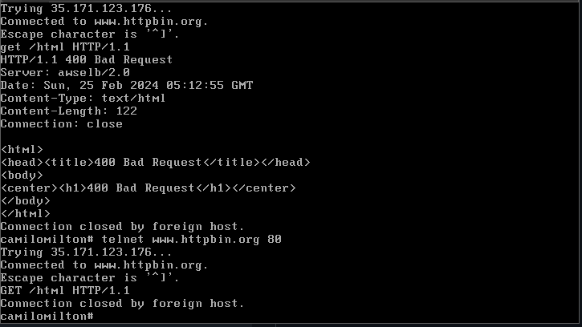

### Contar el número de caracteres

Debido a que no pudimos realizar una conexion con ninguna de las dos direcciones, no podemos ejecutar el comando para contar el número de caracteres.

### Investigue: ¿Cuál esla diferencia entre los verbos GET y POST? ¿Qué otros tipos de peticiones existen?

**GET**: Es utilizado para solicitar datos de un recurso específico en un servidor. Cuando realizas una solicitud GET, los parámetros de la solicitud (si los hay) se envían en la URL. Esta solicitud es visible en la barra de direcciones del navegador y puede ser almacenada en caché por el navegador y por servidores intermedios (como proxies). Se usa comúnmente para recuperar información, como solicitar una página web o un recurso específico de una API.

**POST**: Es utilizado para enviar datos al servidor para su procesamiento. A diferencia de GET, los parámetros de la solicitud POST se envían en el cuerpo del mensaje HTTP, lo que permite enviar una cantidad mayor de datos que con GET. Esta solicitud no es visible en la barra de direcciones del navegador y no es almacenada en caché por el navegador. Se utiliza para enviar formularios en línea, cargar archivos y realizar otras acciones que requieren enviar datos al servidor.

Tenemos otras peticiones HTTP como:

- **PUT**: PUT significa "reemplazar". Sirve para actualizar un recurso completo en el servidor, como modificar un artículo en un blog.
- **DELETE**: DELETE es fácil de adivinar, significa "borrar". Elimina un recurso del servidor, como un archivo subido.
- **OPTIONS**: OPTIONS pregunta "¿qué puedes hacer?". Se usa para saber qué métodos admite un recurso específico.
- **HEAD**: Este método es como "mirar el escaparate". Te da información sobre un recurso sin descargarlo completo, como el tamaño o la fecha de modificación.
- **PATCH**: PATCH es como "arreglar un poco". Aplica modificaciones parciales a un recurso, sin necesidad de reemplazarlo entero.
- **TRACE**: Este método realiza una prueba de bucle de retorno de mensaje a lo largo de la ruta al recurso de destino.
- **CONNECT**: Este método establece un túnel hacia el servidor identificado por el recurso.

### Curl

curl "www.httpbin.org"

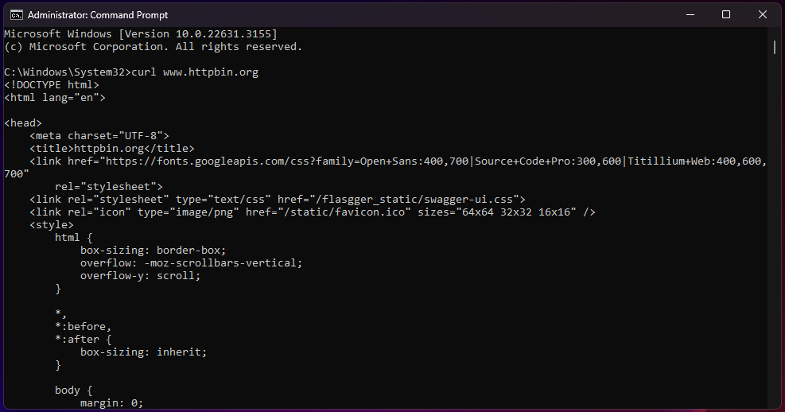

Utilice ahora el parámetro -v y con el parámetro -i:

-v: 
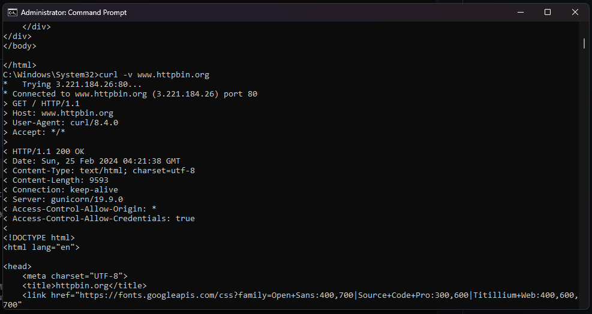

-i: 
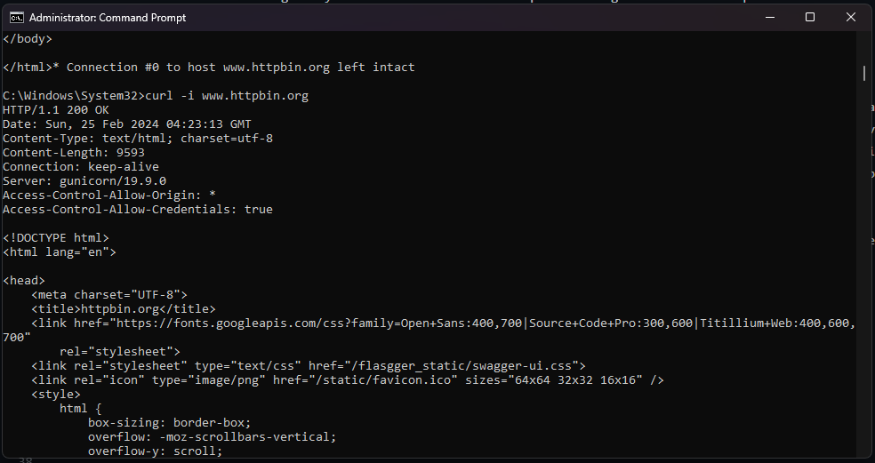

Los parámetros -v e -i en el comando curl tienen distintos propósitos:

- -v: Al emplear este parámetro, se activa el modo detallado o "verbose". Esto conlleva a que curl proporcione información ampliada y detallada acerca de la transferencia de datos, presentando los pormenores tanto de la solicitud como de la respuesta. Este modo es útil para depurar y comprender el funcionamiento interno del proceso.
- -i: Por otro lado, al utilizar el parámetro -i, se añade la cabecera HTTP a la salida. curl mostrará tanto los encabezados de respuesta HTTP como los datos del cuerpo, combinándolos en la salida para una mejor comprensión del intercambio de información.

### PARTE 2

- **¿Por qué MVC obtiene ese nombre?**

MVC se llama así debido a su arquitectura de tres componentes principales:
**Modelo (Model):** Representa los datos y la lógica empresarial de la aplicación.
**Vista (View):** Presenta los datos al usuario y maneja la interfaz de usuario.
**Controlador (Controller):** Controla las solicitudes del usuario, interactúa con el modelo y selecciona la vista adecuada para mostrar los resultados.

- **¿Cuáles son las ventajas de usar MVC?**
Algunas de las ventajas de utilizar la arquitectura MVC en aplicaciones web incluyen:
**Separación de preocupaciones:** MVC divide la aplicación en componentes separados, lo que facilita la gestión y el mantenimiento del código.
**Reutilización de código:** Los componentes del modelo y la vista pueden reutilizarse en diferentes partes de la aplicación o en proyectos futuros.
**Escalabilidad:** Facilita la escalabilidad de la aplicación al permitir la sustitución o ampliación de componentes sin afectar a otros.
**Pruebas unitarias:** Permite realizar pruebas unitarias más eficaces y facilita la automatización de pruebas.
Colaboración entre equipos: Permite que equipos diferentes trabajen en paralelo en diferentes partes de la aplicación.

- **¿Qué diferencia tiene la estructura de directorios de este proyecto comparado con las de proyectos pasados (con solo maven y java EE)?**
La estructura de directorios en un proyecto Spring MVC es diferente de la de proyectos Maven y Java EE debido a la naturaleza específica de Spring MVC. En un proyecto Spring MVC, se suelen encontrar carpetas y paquetes como:
**src/main/java:** Contiene las clases Java, incluyendo controladores y modelos.
**src/main/resources:** Contiene recursos como archivos de configuración XML y propiedades.
**src/main/webapp:** Aquí se encuentran los archivos web, como páginas JSP o archivos HTML.
**WEB-INF:** Contiene archivos de configuración de Spring y configuraciones específicas de Servlet.
Esta estructura está diseñada para facilitar la gestión de componentes MVC y la configuración de Spring.

- **¿Qué anotaciones usaste y cuál es la diferencia entre ellas?**
En un proyecto Spring MVC, se utilizan diversas anotaciones para configurar y gestionar controladores, vistas y otras partes de la aplicación. Algunas anotaciones comunes incluyen:
**@Controller:** Anota una clase como controlador.
**@RequestMapping:** Define una URL o patrón de URL que se asigna a un método del controlador.
**@ModelAttribute:** Utilizada para asociar un método o parámetro de método con un modelo.
**@GetMapping, @PostMapping, etc.:** Anotaciones para especificar los métodos HTTP que maneja un controlador.
**@Autowired:** Utilizada para inyectar dependencias en los controladores u otros componentes de Spring.
**@RequestMapping:** Permite especificar una URL base para todos los métodos de un controlador.

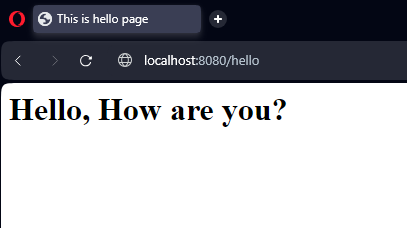

### PARTE 3

- **¿Qué es RESTful?**

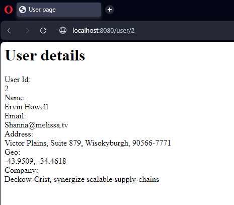

RESTful es una forma de diseñar interfaces de programación de aplicaciones (API) que se adhieren a los principios de REST, que significa Transferencia de Estado Representacional. RESTful es como un conjunto de modales para una conversación entre aplicaciones. Estas reglas aseguran que las aplicaciones se entiendan y puedan intercambiar información de forma eficiente y clara.

- Si utilizo un framework como [Boostrap CSS](https://getbootstrap.com/) para qué el apartado gráfico se vea más profesional, **¿en qué capa se haría su uso?**

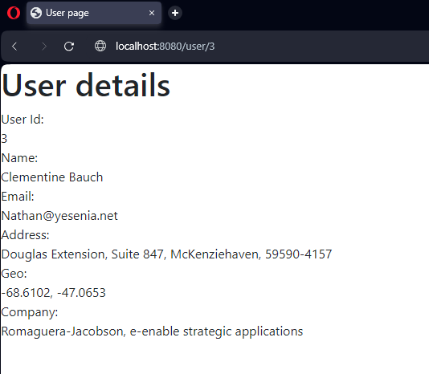

### PARTE 4

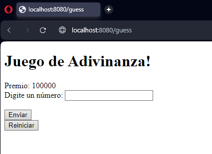

-  **¿Qué pasa si abro el sitio de juegos en dos navegadores difententes?**
Se abren independientemente y tendran saldos segun cada uno

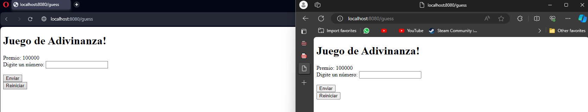
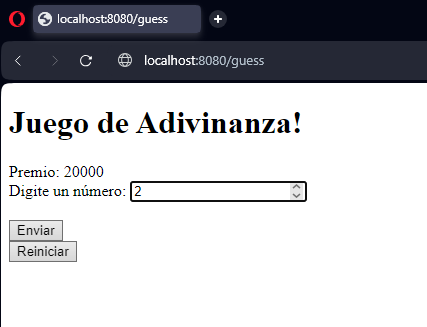
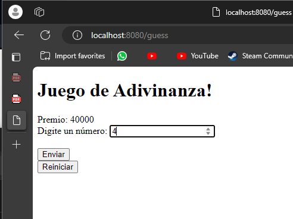
 
-  **Si quisiera qué a cada jugador le aparecieran independientemente sus respectivos saldos. ¿Qué habría que hacer?**
  Se puede utilizar una base de datos para almacenar la información del jugador, incluido su saldo. Cada jugador tendría su propio registro en la base de datos, y el saldo se actualizaría en función de sus acciones en el juego.


